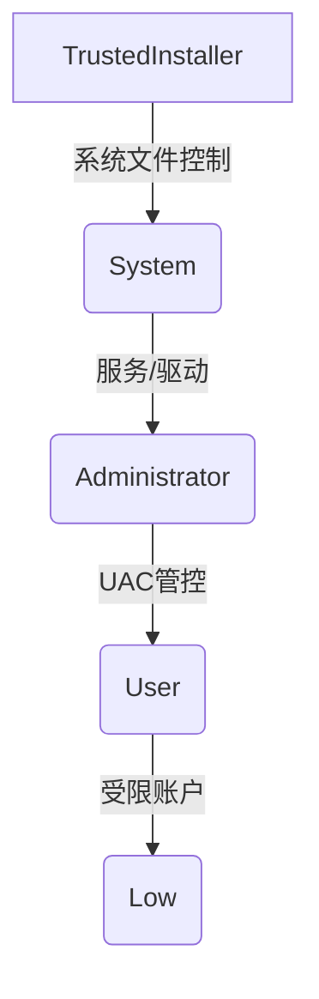

# Windows权限提升全维度指南

## 一、Windows权限体系深度解析
### 1. 权限控制核心组件
```markdown
SID结构解析：
S-R-X-Y (示例：S-1-5-21-3623811015-3361044348-30300820-1013)
- S：固定标识符
- R：修订版本（通常为1）
- X：标识颁发机构（如5表示NT Authority）
- Y：子颁发机构组（如21表示非唯一标识符）

访问令牌(Access Token)：
包含用户SID、组SID、特权列表、所有者SID等元数据。通过`whoami /all`可查看当前令牌详情 [6]

UAC机制：
采用双令牌架构，管理员账户拥有：
- 筛选令牌（普通权限）
- 完全令牌（高权限）
触发UAC需满足完整性级别>= High [10]
```

### 2. 权限等级分层模型

- **System**：SYSTEM用户权限，可访问SAM等核心组件 [5]
- **High**：管理员组用户（需UAC确认）
- **Medium**：标准用户权限（默认级别）
- **Low**：沙箱/服务账户权限（如IIS应用池账户）[6]

## 二、系统信息深度枚举策略
### 1. 基础信息采集矩阵
```powershell
# 用户拓扑分析
Get-LocalUser | Select Name, SID, Enabled 
Get-LocalGroupMember "Remote Desktop Users"

# 系统指纹识别
systeminfo | findstr /B /C:"OS Name" /C:"OS Version"
wmic qfe get HotFixID | findstr KB500443

# 应用资产测绘
Get-ItemProperty "HKLM:\SOFTWARE\Wow6432Node\Microsoft\Windows\CurrentVersion\Uninstall\*" | 
    Select DisplayName, DisplayVersion, Publisher
```

### 2. 网络拓扑测绘技术
```powershell
# ARP缓存分析
arp -a | findstr dynamic

# 路由策略提取
route print | findstr 0.0.0.0

# 活动连接检测
netstat -ano | findstr ESTABLISHED
```

### 3. 敏感信息狩猎技术
```powershell
# 快速定位密码文件
Get-ChildItem -Path C:\ -Include *.config, *.xml, *.ini -Recurse -ErrorAction SilentlyContinue |
    Select FullName | Out-File scan_result.txt

# 凭据文件深度挖掘
Select-String -Path C:\Users\*\AppData\Roaming\*.ini -Pattern "password="
```

## 三、用户上下文切换技术
### 1. PsExec高级用法
```powershell
# 远程凭据注入（需SMB开放）
PsExec.exe \\target -u domain\user -p password -h cmd.exe

# 隐蔽执行模式
PsExec -s -d -c malware.exe
```
- `/accepteula`：绕过许可协议
- `-i`：交互式会话建立

### 2. 受限环境下的凭证重用
```powershell
# 提取RDP连接历史
Get-ChildItem "HKLM:\SOFTWARE\Microsoft\Terminal Server Client\Servers"

# 破解VNC配置
Get-ItemProperty "HKCU:\Software\ORL\WinVNC3\Password"
```

## 四、PowerShell痕迹追踪
### 1. 历史记录深度提取
```powershell
# 跨用户历史提取
Get-Content "C:\Users\*\AppData\Roaming\Microsoft\Windows\PowerShell\PSReadLine\*" -ErrorAction SilentlyContinue

# 内存命令回溯
(Get-PSReadlineOption).HistorySavePath | Get-Content
```

### 2. PowerShell远程管理
```powershell
# 建立远程会话
$cred = Get-Credential
Enter-PSSession -ComputerName DC01 -Credential $cred

# 文件传输通道
Invoke-Command -ComputerName DC01 -ScriptBlock { 
    Get-ChildItem C:\敏感目录 
} -Credential $cred
```

## 五、自动化提权工具链
### WinPEAS深度剖析
```artifact
id: winpeas-flow
name: WinPEAS检测流程
type: mermaid
content: |-
  graph TD
    A[启动检测] --> B{系统信息收集}
    B --> C[补丁状态分析]
    B --> D[服务配置审计]
    B --> E[注册表键值扫描]
    C --> F[已知漏洞匹配]
    D --> G[可写服务路径检测]
    E --> H[AlwaysInstallElevated检查]
    F --> I[生成漏洞利用建议]
    G --> J[路径劫持方案]
    H --> K[MSI安装提权策略]
```
核心检测模块：
- **Services**: 检查可修改的BINARY_PATH
- **Registry**: 扫描自动运行键值
- **Files**: 查找全局可写目录 
